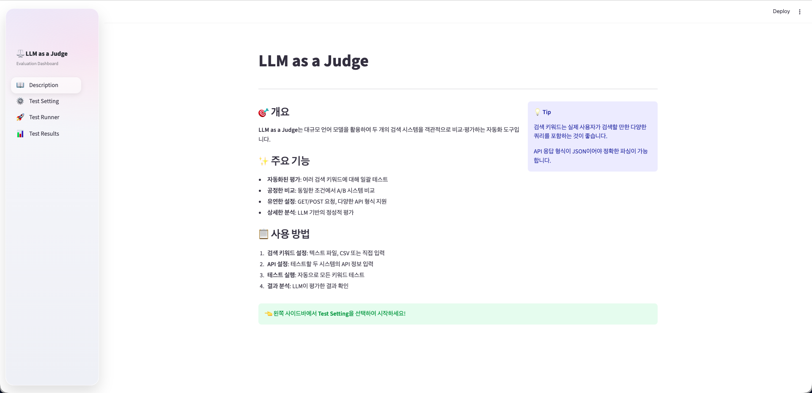
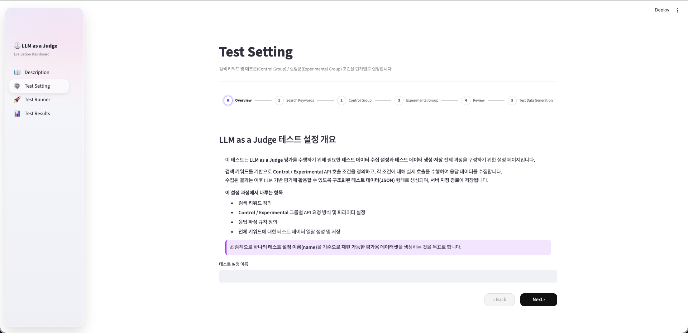
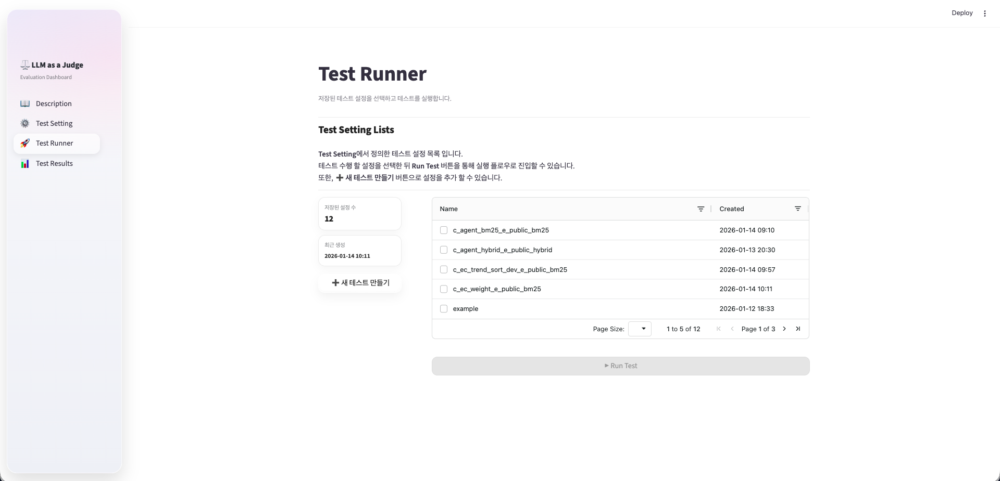
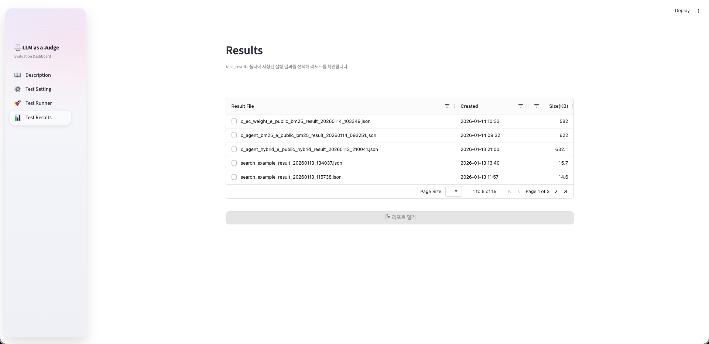
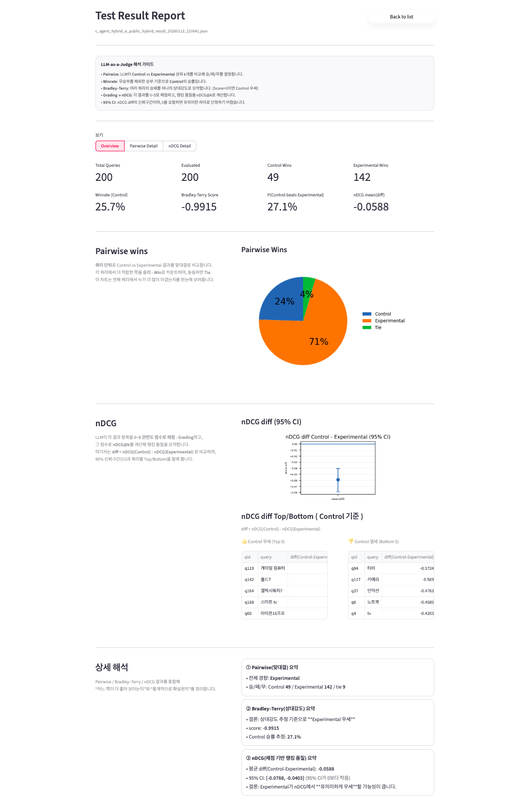
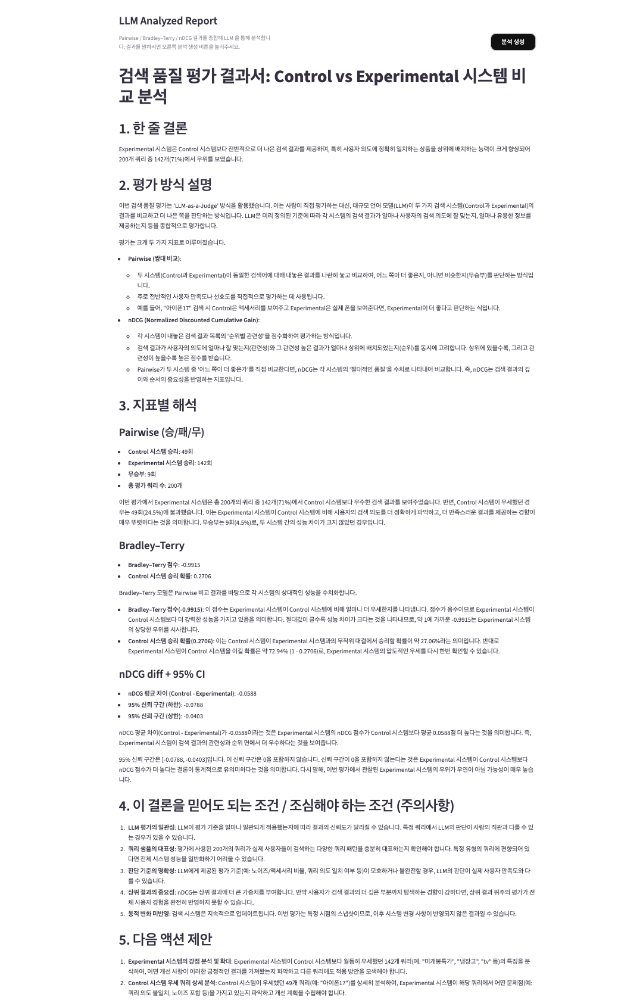
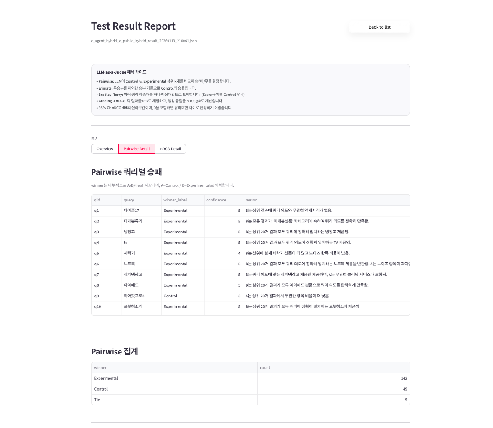
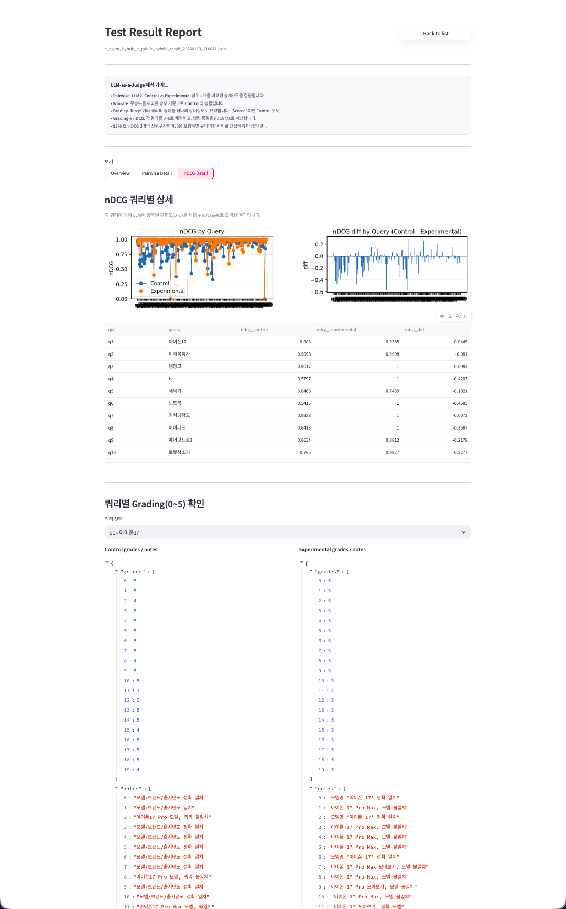

# 🧑‍⚖️ LLM as a Judge – Evaluation Dashboard

**LLM as a Judge** is a web-based evaluation system that uses Large Language Models (LLMs) as an automated judge to **compare and analyze the quality of two search systems** (Control vs Experimental).

It enables teams to evaluate search quality **without manual labeling**, while still producing **explainable, human-readable evaluation reports**.

---

## ✨ Key Features

- 🔍 **Automated Search Evaluation**
  - Run large-scale evaluations across many queries
- ⚖️ **Fair Comparison**
  - Pairwise (head-to-head) evaluation with position-bias mitigation
  - Bradley–Terry model for relative strength estimation
- 📊 **Ranking Quality Metrics**
  - LLM-based relevance grading (0–5)
  - nDCG@k with confidence intervals
- 🧠 **LLM-Generated Interpretation**
  - Natural-language explanation of results (Korean)
  - Clear conclusions for non-experts
- 🖥 **Streamlit UI**
  - End-to-end workflow: setup → run → analyze → report

---

## 🛠 Installation & Setup

### 1️⃣ Requirements

- Python **3.10+**

Check your version:

```bash
python --version
```

### 2️⃣ Install Dependencies (using uv)
```bash
pip install uv
uv sync
```

All dependencies are managed via pyproject.toml.

### 3️⃣ Environment Variables

Copy the example environment file:

```bash
cp .env_example .env
```

Edit .env and configure your API keys:

```dotenv
# Gemini (required)
GEMINI_API_KEY=your_gemini_api_key
GEMINI_API_MODEL=gemini-2.5-flash
GEMINI_API_TEMPERATURE=0.0
GEMINI_API_MAX_RETRIES=3

# OpenAI (optional)
OPENAI_API_KEY=your_openai_api_key
OPENAI_API_MODEL=gpt-4o
```

### 4️⃣ Run the Application

```bash
streamlit run app.py 
```

```bash
uv run python -m streamlit run app.py
```

The dashboard will open automatically in your browser.

---

## 🧭 Application Structure

**Sidebar Navigation**
- **Description** – Project overview and evaluation concept
- **Test Setting** – Configure evaluation scenarios
- **Test Runner** – Execute evaluations
- **Test Results** – Analyze results and reports

---

## 📘 Description Page




The Description page explains:
- What LLM as a Judge means
- Why LLM-based evaluation is useful
- How Pairwise, Bradley–Terry, and nDCG metrics work

This page is intended for first-time users and stakeholders.

---

## ⚙️ Test Setting



Create a reusable evaluation configuration.

### Step Flow 
1. **Overview**
   - Name your test (used as an identifier)
2. **Search Keywords**
   - Define queries (manual input or CSV)
3. **Control Group**
   - Configure the baseline search API
4. **Experimental Group**
   - Configure the candidate or improved search API
5. **Review**
   - Verify all settings
6. **Test Data Generation**
   - Execute API calls and store raw results as JSON

### API Configuration Highlights

- Supports **GET** and **POST**
- Fixed parameters + keyword parameters
- **Multiple keyword parameters supported**
  - Example: query, sparseQuery
- Optional response parsing via JSON path
- Built-in API test with cURL preview

---

## 🚀 Test Runner



- Displays saved test configurations
- Select a test by checkbox or row click
- Click **Run Test** to start evaluation
- Queries are evaluated sequentially with progress tracking

---

## 📊 Test Results



Each completed run produces a **Test Result Report**.

### 1️⃣ Overview Tab



Provides a high-level summary of the evaluation.

**Key Metrics**
- Total Queries
- Control / Experimental Wins
- Win Rate
- Bradley–Terry Score & Win Probability
- Mean nDCG Difference

**Visualizations**
- Pairwise Wins (Pie Chart)
- nDCG Difference with 95% Confidence Interval
- Top / Bottom queries by nDCG difference

**LLM Interpretation**
- One-line conclusion
- Metric-by-metric explanation
- Reliability notes and cautions
- Suggested next analysis steps

<details>
<summary>LLM Interpretation Example</summary>



</details>

### 2️⃣ Pairwise Detail Tab



Query-level head-to-head results:
- Winner (Control / Experimental / Tie)
- Confidence score
- LLM-generated reasoning

This answers:

> “Which system performed better for this query, and why?”

### 3️⃣ nDCG Detail Tab




Ranking-quality analysis per query:
- nDCG scores (Control vs Experimental)
- Query-level nDCG charts
- Detailed grading inspection:
  - Item-level relevance scores (0–5)
  - Reasons for penalties or bonuses

This answers:

> “Where exactly did ranking quality improve or degrade?”

---

## 🧠 Evaluation Methodology

### Pairwise Comparison
- The LLM compares two ranked lists directly
- Chooses which list better satisfies the query
- Randomized ordering prevents position bias


### Bradley–Terry Model
- Aggregates pairwise outcomes
- Estimates relative system strength
- Outputs win probability and score


### LLM Grading → nDCG
- Each result item is graded (0–5 relevance)
- Grades are converted into nDCG@k
- Mean difference and 95% CI summarize ranking quality trends

---

## ✅ When This Tool Is Most Useful

- Evaluating search algorithm changes
- Comparing ranking strategies without manual labeling
- Explaining search quality changes to stakeholders
- Identifying query-level regressions or improvements

---

## ⚠️ Notes & Limitations
- LLM judgments are probabilistic
- nDCG confidence intervals crossing zero indicate weak statistical evidence
- Low-confidence pairwise results should be reviewed carefully
